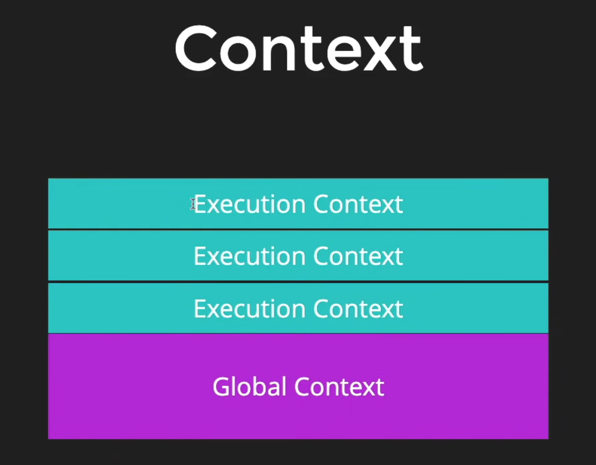
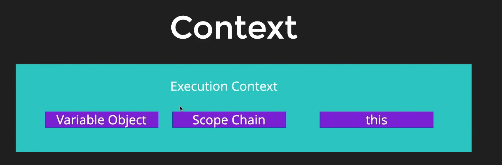
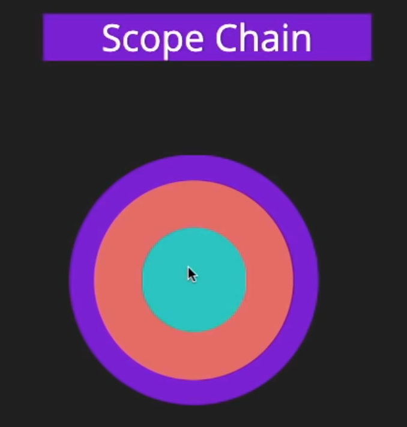
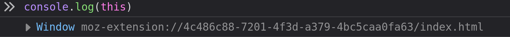

# Getting Started
JavaScript (JS) is a lightweight, interpreted, or [just-in-time](https://en.wikipedia.org/wiki/Just-in-time_compilation) compiled programming language with [first-class](https://developer.mozilla.org/en-US/docs/Glossary/First-class_Function) functions.

## JS Engine
The JavaScript engine is an interpreter that parses and executes a JavaScript program. e.g. V8 Engine, Spider Monkey

Javascript could only run in browsers before but now, things are changed runtime environment like Node.js, Deno can be used to run js without needing a browser.
Node.js uses V8 engine.

# Basics

A variable is a container for a value, like a number we might use in a sum, or a string that we might use as part of a sentence.

Variables can be declared using these keywords -

- var
- let
- const 
    - constant can't be changed after declaration

Datatypes in JS - 
- https://developer.mozilla.org/en-US/docs/Web/JavaScript/Reference/Operators/typeof

Operators in JS
- https://developer.mozilla.org/en-US/docs/Web/JavaScript/Reference/Operators/Operator_Precedence

### Conditionals

1. if..else
2. switch
3. ternary operator


### Expressions and Operators

https://developer.mozilla.org/en-US/docs/Web/JavaScript/Reference/Operators

### Coercion and truthy/falsy values

- Coercion is like implicit type conversion in javascript.
    - e.g. `2 + "2"` will return `22`
- Falsy Values (all values below are considered as falsy in JS)
    - `undefined`
    - `null`
    - `0`
    - `''`
    - `NaN`
- All values other than these are considered as truthy values

```js
// this code will not log anything
if(undefined) {
    console.log(true)
}
```

# Intermediate

## Functions
Functions in javascript can be declared by following syntax:
```js
function sayHello(name) {
    console.log("Hello there, ");
    console.log(`Hello there, ${name}`);
}


// Calling functions
// sayHello();

// Referencing a function
// sayHello;
```

Javascript is allows functional programming.

In functional programming, functions can be treated as variables.

```js
const greetings = namastey();

or 

const anotherOne = function() {return "something"}

console.log(greetings());
```


## Context
Javascript have a concept of context.
And there is a global context.

Global Context
- In a Browser the global context is => `window`
- In a Node the global context is => something different than browser it shows `{}`

### Code Hoisting

Function and variable declarations are hoisted in JavaScript. This means that they are stored in memory of the current Execution Context and made available within the Execution Context even before the execution of the code begins.

Everything declared are registered in the context and thats why,
a function declared below call can be called before declaring in JS.

```js
tipper("5")

function tipper(a) {
    var bill = parseInt(a);
    console.log(bill + 5);
}
// this will work 
// this is called CODE HOISTING
```

There are always two types of contexts
1. Global context
2. Context which is currently executing.

Execution Context ->
Whenever a function is called, the JavaScript engine creates a different type of Execution Context known as a Function Execution Context (FEC) within the GEC to evaluate and execute the code within that function.
Since every function call gets its own FEC, there can be more than one FEC in the run-time of a script.




Rules for execution context:
1. Function declarations are scanned and made available.
2. Variable declarations are scanned and made undefined.

### Scope Chain

😆 => Small guy can ask for icecream if he doesnt have from elder but elder cannot ask vice versa.



### `this` Keyword




# Advanced